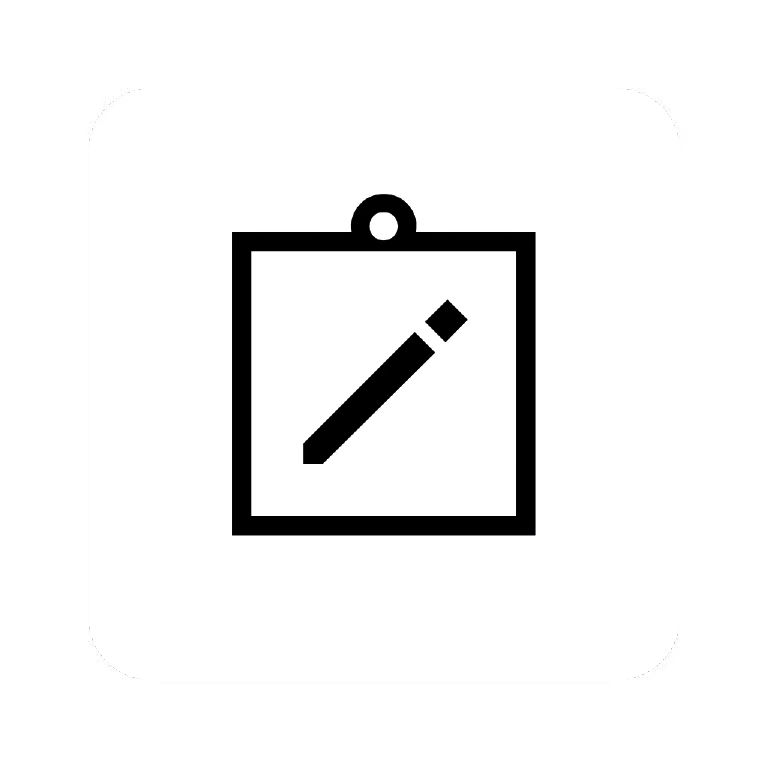
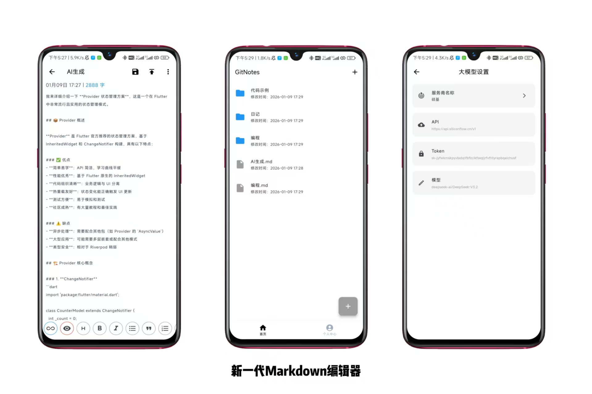
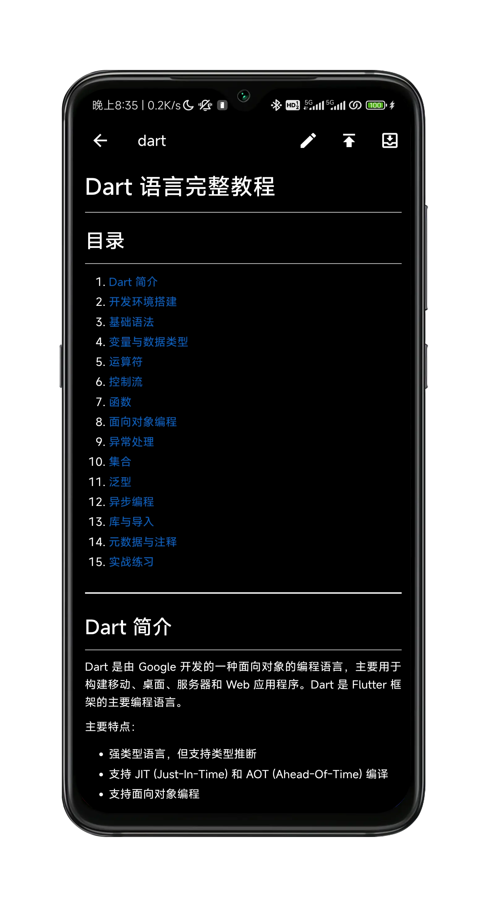
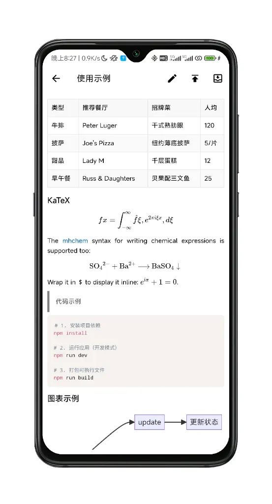
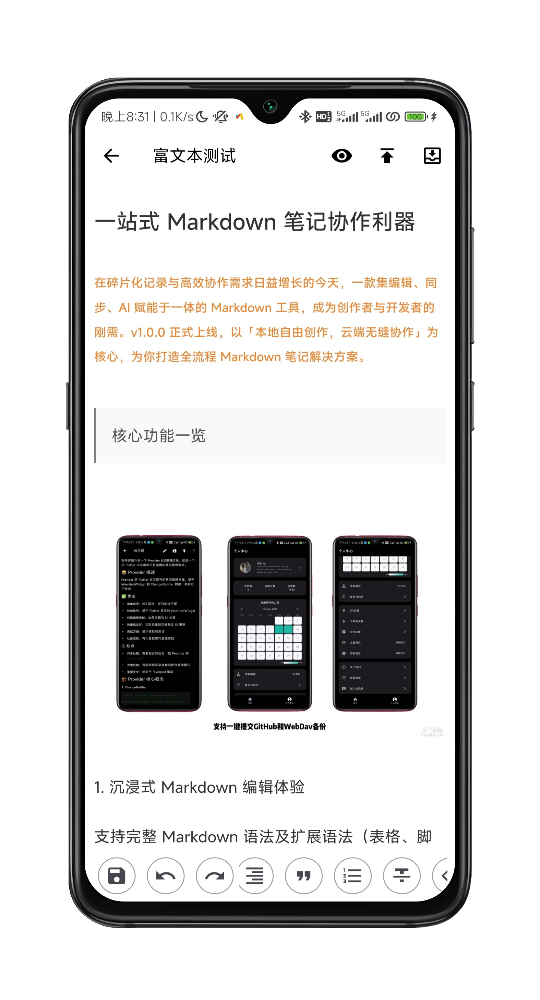
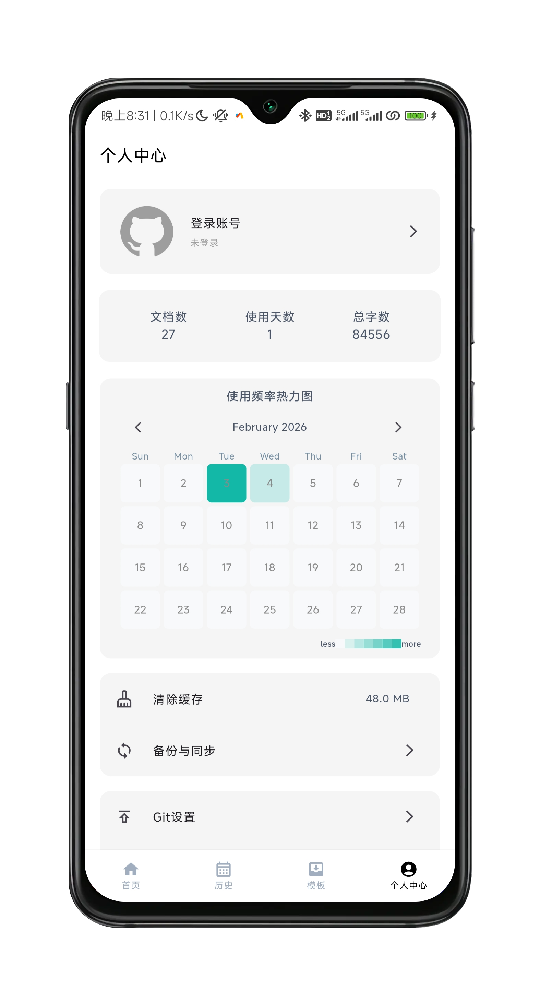

<div align="center">
    
</div>
<h1 align="center" style="border-bottom: none">
    <b>
        <a href="https://github.com/1990569689/Gitdiary"> ⭐️  Gitdiary ⭐️ <br></a><br>
    </b>
</h1>

<p align="center"><a href="README.md">简体中文</a> | <a href="./images/README_EN.md">English</a></p>
<p align="center">
Gitdiary is a cross-platform Markdown and rich text diary application developed using Flutter.
</p>
<div align="center">
  
  
  
  
  
  
  
</div>
<br>
<div align="center">
  <strong>A one-stop mobile tool for Markdown and rich text note collaboration</strong>
  <p>A comprehensive rich text note solution featuring local free creation and seamless cloud collaboration</p>
</div>
<p align="center"></p>
<p align="center"></p>

## 🌟 Project Introduction

Gitdiary is a cross-platform Markdown/rich text editing tool developed based on Flutter 3.22.0, specifically designed for creators, developers, students, and researchers. By integrating an immersive editing experience, multi-terminal data synchronization, AI-powered creation, and global localization, it makes note-taking more efficient and free.

## ✨ Core Features

### 📝 Immersive Editing Experience
- Supports **full Markdown syntax** and extended syntax (tables, footnotes, code block syntax highlighting).
- Custom text colors, font styles, and layout rules to create personalized notes.
- Seamless switching between Day/Night themes to adapt to different scenarios and reduce visual fatigue during long writing sessions.
- **Dual editing modes for Rich Text and Markdown**, meeting diverse writing needs.

#### 📈 Feature Preview

| Night Mode | Text Editing |
|---|---|
|||
| Rich Text Rendering | Personal Center |
|||

### ☁️ Multi-terminal Data Sync & Backup
- **Deep GitHub Integration**: Account login, one-click note submission to repositories, and downloading of open-source note resources.
- **Triple Backup Guarantee**: GitHub sync + WebDAV cloud backup, supporting local file import and export.
- **GitHub Image Hosting Linkage**: One-click image upload with automatic link embedding to solve cross-platform display issues.
- Version Management: Leveraging Git for version tracking and recovery of notes.

### 🤖 AI-Powered Creation
- Integrated with OpenAI series AI APIs, supporting streaming Q&A and content assistance.
- Application scenarios: Outline generation, content polishing, code explanation, and troubleshooting.
- Real-time response to significantly boost creative efficiency.

### 🌐 Globalization Adaptation
- Multi-language switching to meet the usage habits of users in different regions.
- Follows Material Design specifications for a consistent interaction experience.

### 🎯 Target Audience
- **Developers**: Writing technical documentation, comments, and open-source project READMEs with version management and collaboration.
- **Content Creators**: Writing blogs, reading notes, and mind maps with customizable styles for personalized notes.
- **Students/Researchers**: Organizing study notes and thesis outlines, with multiple backups ensuring data security.

## 🧪 Development Roadmap

### Completed

- ✅ Rich text editor with webview rendering; supports bold, italic, underline, subscript, strikethrough, unordered lists, ordered lists, quotes, code, checkboxes, images, videos, audio, hyperlinks..., and custom HTML.
- ✅ GitHub login, submitting notes to GitHub, pulling GitHub note files, and uploading images to GitHub.
- ✅ Markdown editor; supports basic markdown operations, mathematical formulas, code, Gantt charts, Mermaid, Gantt, KaTeX, chemical formulas, multiple rendering engines, and integrated Vditor.
- ✅ WebDAV backup, and local backup import/export.
- ✅ Integrated OpenAI series AI APIs, supporting streaming Q&A and content assistance.
- ✅ Multi-language switching to meet different regional user habits.
- ✅ Day and Night mode switching.
- ✅ Markdown editor settings.
- ✅ Usage frequency heatmap.
- ✅ Shortcut command integration.
- ✅ Batch editing functionality.

## 🚀 Quick Start

### Environment Requirements
- Flutter SDK 3.22.0 or higher
- Dart SDK 3.4.0 or higher
- Android Studio / VS Code (with Flutter plugin)

Project Structure Reference:
```
lib/
├── generators/        # Custom markdown parsing files
├── page/              # Page files
├── rich/              # Rich text editor
├── utils/             # Utility classes
├── widget/            # Custom components
├── main.dart          # Main file
├── chat.dart          # LLM integration file
├── databse.dart       # Database file
├── introduction.dart  # App onboarding file
├── provider.dart      # State management file
├── theme.dart         # Theme file
├── update.dart        # Update file
├── main.dart          # Main file
├── webview.dart       # Webview file
└── index.dart         # Navigation
```

### Installation and Running
```bash
# Clone repository
git clone https://github.com/1990569689/Gitdiary.git

# Enter project directory
cd gitdiary

# Get dependencies
flutter pub get

# Run project
flutter run

# Build APK (Android)
flutter build apk --release

# Build IPA (iOS)
flutter build ios --release
```

### Star History

<a href=""> 
  <picture> 
    <source media="(prefers-color-scheme: dark)" srcset="https://api.star-history.com/svg?repos=1990569689/Gitdiary&type=date&theme=dark&legend=top-left" /> 
    <source media="(prefers-color-scheme: light)" srcset="https://api.star-history.com/svg?repos=1990569689/Gitdiary&type=date&legend=top-left" /> 
     
  </picture> 
 </a>
