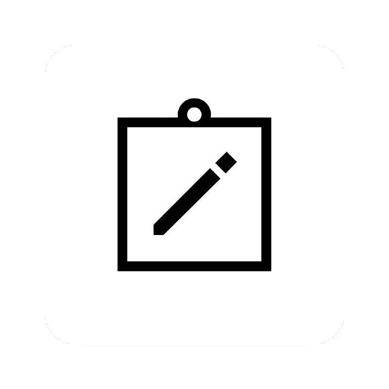
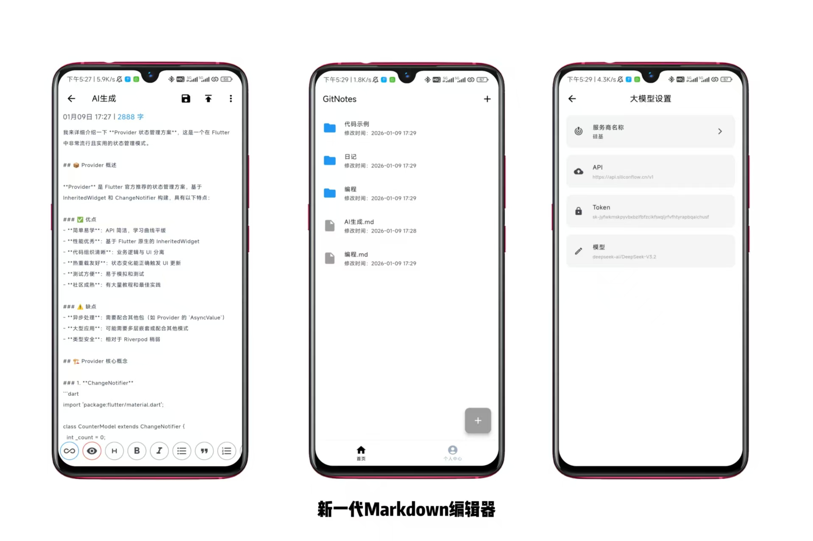
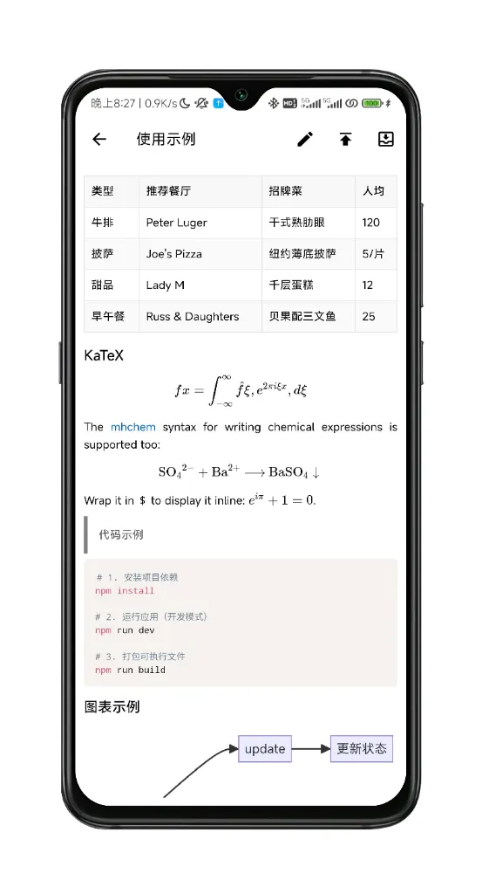
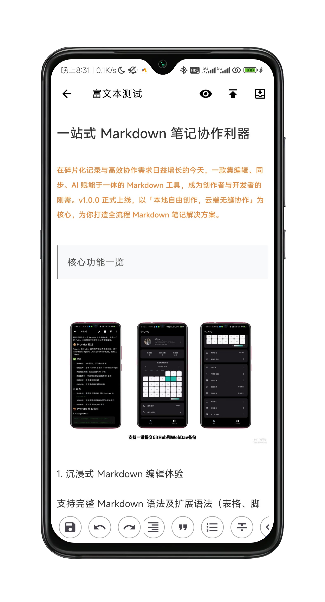

<div align="center">
    
</div>
<h1 align="center" style="border-bottom: none">
    <b>
        <a href="https://github.com/19905696898/Gitdiary"> ⭐️  Gitdiary ⭐️ <br></a><br>
    </b>
</h1>
<p align="center">
Gitdiary is a cross-platform Markdown and rich-text diary application built with Flutter.
</p>
<p align="center"><a href="README.md">简体中文</a> | <a href="./README_EN.md">English</a></p>

<div align="center">
  
  
  
  
  
  
  
</div>
<br>


<div align="center">
  <strong>All-in-One Mobile Markdown & Rich-Text Note Collaboration Tool</strong>
  <p>Create freely locally, collaborate seamlessly in the cloud — a complete rich-text note solution</p>
</div>

<p align="center"></p>
<p align="center"></p>

## 🌟 Project Introduction
Gitdiary is a cross-platform Markdown/rich-text editing tool built on Flutter 3.22.0, designed for creators, developers, students, and researchers. It combines an immersive editing experience, multi-device data sync, AI-powered writing, and global compatibility to make note-taking more efficient and flexible.

## ✨ Core Features

### 📝 Immersive Editing Experience
- Supports **full Markdown syntax** and extensions (tables, footnotes, code blocks with syntax highlighting)
- Customizable text colors, fonts, and layout rules for personalized notes
- Seamless light/dark mode switching to reduce eye strain during long sessions
- **Dual-mode editing**: Rich Text & Markdown for diverse writing needs

#### 📈 Feature Preview

| Dark Mode | Text Editor |
|---|---|
|||
| Rich Text Render | Profile |
|||

### ☁️ Multi-Device Sync & Backup
- **Deep GitHub integration**: Login, one-click commit notes to repo, download open-source note resources
- **Triple backup protection**: GitHub Sync + WebDAV cloud backup, local import/export supported
- **GitHub Image Hosting**: One-click image upload with auto-inserted links for cross-platform display
- Version control: Git-powered note version tracking & recovery

### 🤖 AI-Powered Creation
- Integrates with OpenAI-series AI APIs for streaming Q&A and content assistance
- Use cases: outline generation, content polishing, code explanation, problem solving
- Real-time response to greatly boost productivity

### 🌐 Global Compatibility
- Multi-language support for users worldwide
- Follows Material Design guidelines for consistent UX

### 🎯 Target Users
- **Developers**: Write docs, comments, READMEs, with version control & collaboration
- **Content Creators**: Draft blogs, reading notes, mind maps with custom styles
- **Students & Researchers**: Organize study notes, paper outlines, secure data with multiple backups

## 🧪 Development Plan

### Completed
- ✅ Rich-text editor with webview rendering: bold, italic, underline, subscript, strikethrough, lists, quotes, code, checkbox, images, video, audio, links, custom HTML support
- ✅ GitHub login, push notes to GitHub, pull notes from GitHub, upload images to GitHub
- ✅ Markdown editor with basic operations, math formulas, code, Gantt charts, mermaid, katex, chemical formulas, multiple render engines, integrated with Vditor
- ✅ WebDAV backup, local backup import & export
- ✅ OpenAI API integration with streaming Q&A and content assistance
- ✅ Multi-language support
- ✅ Light & dark mode switching
- ✅ Markdown editor settings
- ✅ Usage frequency heatmap
- ✅ Shortcut integration
- ✅ Batch editing

## 🚀 Quick Start

### Requirements
- Flutter SDK 3.22.0+
- Dart SDK 3.4.0+
- Android Studio / VS Code with Flutter plugin

Project Structure
```
lib/
├── generators/        # Custom markdown parsers
├── page/              # Page files
├── rich/              # Rich-text editor
├── utils/             # Utilities
├── widget/            # Custom widgets
├── main.dart          # Entry point
├── chat.dart          # LLM integration
├── databse.dart       # Database
├── introduction.dart  # App intro
├── provider.dart      # State management
├── theme.dart         # Themes
├── update.dart        # Updates
├── webview.dart       # Webview
└── index.dart         # Navigation
```

### Install & Run
```bash
# Clone
git clone https://github.com/19905696898/Gitdiary.git

# Enter directory
cd gitdiary

# Get dependencies
flutter pub get

# Run
flutter run

# Build APK (Android)
flutter build apk --release

# Build IPA (iOS)
flutter build ios --release
```

### Star History
<a href=""> 
  <picture> 
    <source media="(prefers-color-scheme: dark)" srcset="https://api.star-history.com/svg?repos=19905696898/Gitdiary&type=date&theme=dark&legend=top-left" /> 
    <source media="(prefers-color-scheme: light)" srcset="https://api.star-history.com/svg?repos=19905696898/Gitdiary&type=date&legend=top-left" /> 
     
  </picture> 
</a>
