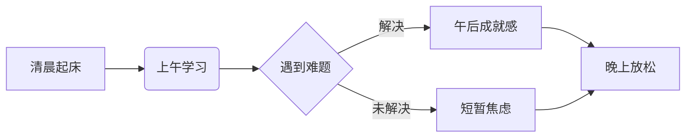
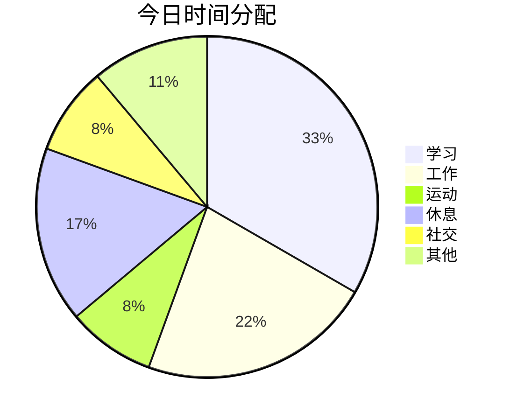

# 📖 我的数字日记

## 📅 2025年3月20日 星期四 · **春分** · 天气: 🌤️ 晴转多云

---

### 🎯 今日核心任务
1. [x] 完成Markdown学习项目
2. [ ] 整理读书笔记
3. [x] 运动30分钟

---

## 📝 学习记录

### 一级标题展示
这是普通段落文字，可以进行**加粗**、*斜体*、~~删除线~~等基本格式化。

> **名言启示**：今天读到一句很喜欢的话：
> > “代码如诗，文档如画”——好的文档让技术有了温度

### 代码实践片段
今天尝试用Python写了个小工具：

```python
def markdown_parser(text: str) -> str:
    """
    简易Markdown解析器示例
    """
    import re
    
    # 标题转换
    text = re.sub(r'^### (.*)$', r'<h3>\1</h3>', text, flags=re.MULTILINE)
    
    return f"""
    <!DOCTYPE html>
    <html>
    <body>
    {text}
    </body>
    </html>
    """
    
if __name__ == "__main__":
    sample = "### 这是一个测试"
    print(markdown_parser(sample))
```

也复习了JavaScript的基础：

```javascript
// 高亮当前日期
const highlightToday = () => {
    const today = new Date().toLocaleDateString('zh-CN');
    document.querySelectorAll('.date-tag').forEach(el => {
        if (el.textContent.includes(today)) {
            el.classList.add('active');
        }
    });
    console.log(`今天是: ${today}`);
};
```

### 学习资源整理
| 资源类型 | 名称 | 推荐度 | 备注 |
|---------|------|--------|------|
| 书籍 | 《Markdown指南》 | ⭐⭐⭐⭐⭐ | 入门必读 |
| 网站 | [Markdown官方教程](https://www.markdownguide.org) | ⭐⭐⭐⭐ | 免费实用 |
| 工具 | Typora编辑器 | ⭐⭐⭐⭐ | 所见即所得 |
| 练习 | [Markdown练习场](https://stackedit.io) | ⭐⭐⭐ | 在线编辑 |

---

## 🌈 心情与感悟

### 情绪波动曲线


### 今日三件好事
1. 🌸 发现阳台的多肉开花了
2. 📚 图书馆借到了想看的书
3. ☕ 朋友分享了新的咖啡豆

### 待改进之处
- [ ] 注意力容易被手机打断
- [ ] 午睡时间控制不佳
- [ ] 晚上学习效率偏低

---

## 🍽️ 今日饮食记录

### 早餐
- 燕麦粥 🥣
- 水煮蛋 ×2 🥚
- 黑咖啡 ☕

### 热量摄入估算
- 早餐：约350kcal
- 午餐：约600kcal  
- 晚餐：约500kcal
- **总计：1450kcal**

---

## 📊 时间分配统计



---

## 💭 明日计划
1. **首要任务**
   - [ ] 项目文档整理
   - [ ] 健身课程

2. **次要任务**
   - [ ] 整理照片
   - [ ] 购买生活用品

---

## ✨ 今日小结
> **关键词**：`成长` `探索` `平衡`

今天的Markdown实践让我意识到，**技术的优雅往往藏在细节中**。就像生活中那些看似微小的习惯，日积月累却能塑造完全不同的人生轨迹。

---

*日记结束于：22:47*  
*字数统计：约850字*  
*心情图标：😊 → 🤔 → 😌*